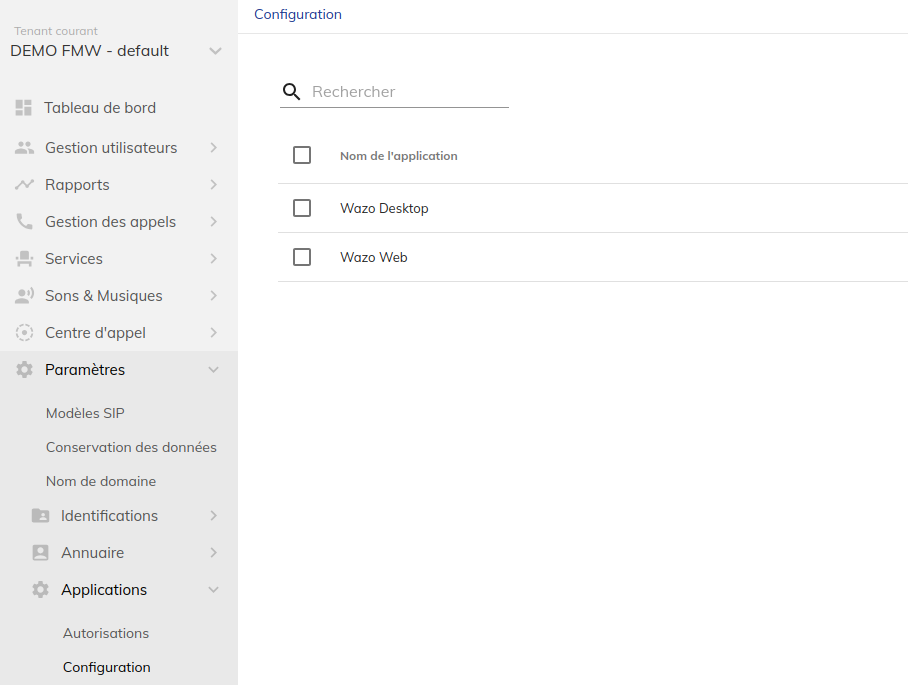
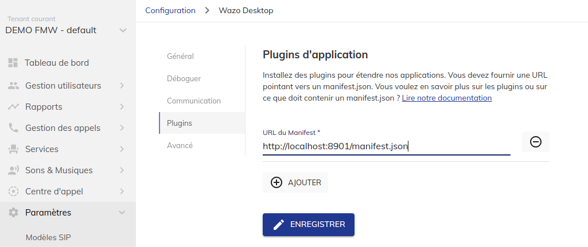

# WDA PLUGIN TEMPLATE

---

This template is a starting point to develop a plugin for WDA.

## Prerequisites

Docker and docker compose must be installed on the server to run the plugin.

## Install

Copy the content of this repo and just use docker and docker compose.

You must adjust the content of Caddyfile, line 19, to add your domain/IP. By default it serves only localhost.

## Run, view logs and stop

### start the container

  docker compose up -d

### view logs

  docker compose logs -f

### Stop the container

  docker compose stop

## Configuration

### Declare the plugin in Portal

To use the plugin on WDA, go to Portal -> Settings -> Applications -> Apps Configuration

create Wazo Desktop/Web configuration, then edit plugins tab and enter this value [http://URL/manifest.json] where the URL points to your docker container deployed of the plugin

### adjust ACL

You may add new ACLs for your user.

## Test

Open in a webbrowser this url : https://app.wazo.io/?manifestUrl=http://URL:8901/manifest.json

=> replace URL by your IP or domain

## License

wda-plugin-template is under MIT license. You can read it in LICENSE file.
